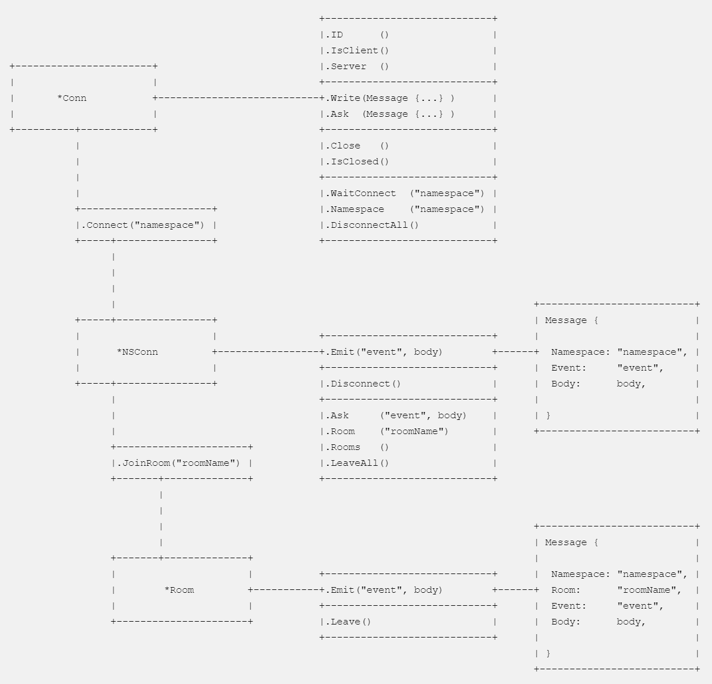

[](https://travis-ci.org/kataras/neffos) [](https://goreportcard.com/report/github.com/kataras/neffos) [](https://godoc.org/github.com/kataras/neffos) [](https://github.com/kataras/neffos/tree/master/_examples) [](https://gitter.im/neffos-framework/community) [](https://github.com/kataras/neffos.js)

## Installation

The only requirement is the [Go Programming Language](https://golang.org/dl/)

```sh
$ go get -u github.com/kataras/neffos
```

## Go Client

Built'n with this package. Types like `Conn`, `NSConn`, `Room` and `ConnHandler[Events, Namespaces, WithTimeout]` are used by both sides(`New` for server, `Dial` for client).

The `neffos` package is "hybrid/isomorphic", same code can be used for both server-side and client-side connections.

```go
import (
    "context"
    "time"
    "fmt"

    "github.com/kataras/neffos"
    "github.com/kataras/neffos/gobwas"
)

const namespace = "default"

var events = neffos.Namespaces{
   namespace: neffos.Events{
        // neffos.OnNamespaceConnect:    ...,
        // neffos.OnNamespaceConnected:  ...,
        // neffos.OnNamespaceDisconnect: ...,
        // neffos.OnRoomJoined: ...
        // neffos.OnRoomLeft: ...

        "chat": func(c *neffos.NSConn, msg neffos.Message) error {
            fmt.Println(string(msg.Body))
            return nil
        },
    },
}

func main() {
    ctx, cancel := context.WithDeadline(context.Background(), time.Now().Add(5 * time.Second))
    defer cancel()

    // init the websocket connection by dialing the server.
    client, err := neffos.Dial(
        // Optional context cancelation and deadline for dialing.
        ctx,
        // The underline dialer, can be also a gobwas.Dialer/DefautlDialer or a gorilla.Dialer/DefaultDialer.
        // Here we wrap a custom gobwas dialer in order to send the username among, on the handshake state,
        // see `Server#IDGenerator`.
        gobwas.Dialer(gobwas.Options{Header: gobwas.Header{"X-MyHeader": []string{"myHeaderValue"}}}),
        // The endpoint, i.e ws://localhost:8080/path.
        "ws://localhost:8080/echo",
        // The namespaces and events, can be optionally shared with the server's.
        events)

    if err != nil {
        panic(err)
    }

    defer client.Close()

    // connect to the "default" namespace.
    nsConn, err := client.Connect(ctx, namespace)
    if err != nil {
        panic(err)
    }

    nsConn.Emit("chat", []byte("Hello from Go client side!"))
    // [...]
}
```

## Typescript/Javascript Client

The client package lives on its own repository for front-end developers: <https://github.com/kataras/neffos.js>.

`neffos.js` client can run through any modern **browser** and **nodejs**.

```javascript
const neffos = require('neffos.js');
// [...]
try {
    const username = prompt("Please specify a username: ");

    const conn = await neffos.dial("ws://localhost:8080/echo", {
        default: { // "default" namespace.
            _OnNamespaceConnected: function (nsConn, msg) {
                console.log("connected to namespace: " + msg.Namespace);
                // [...handleNamespaceConn(nsConn)]
            },
            _OnNamespaceDisconnect: function (nsConn, msg) {
                console.log("disconnected from namespace: " + msg.Namespace);
            },
            _OnRoomJoined: function (nsConn, msg) {
                console.log("joined to room: " + msg.Room);
            },
            _OnRoomLeft: function (nsConn, msg) {
                console.log("left from room: " + msg.Room);
            },
            chat: function (nsConn, msg) { // "chat" event.
                console.log(msg.Body);
            }
        }
    }, { headers: { "X-Username": username } });

    const nsConn = await conn.connect("default");
    nsConn.emit("chat", "Hello from javascript-side client side!");
    // [...]

} catch (err) {
    // [...handleError(err)]
}


```

## Getting Started

```go
package server

import (
    "log"
    "net/http"
    "time"

    "github.com/kataras/neffos"
    "github.com/kataras/neffos/gorilla"
)

func onNamespaceConnect(c *neffos.NSConn, msg neffos.Message) error {
    log.Printf("[%s] connecting to [%s]. To disallow return a non-nil error.",
        c.Conn.ID(), msg.Namespace)
    return nil
}

func onNamespaceConnected(c *neffos.NSConn, msg neffos.Message) error {
    log.Printf("[%s] connected to [%s].", c.Conn.ID(), msg.Namespace)
    return nil
}

func onNamespaceDisconnect(c *neffos.NSConn, msg neffos.Message) error {
    log.Printf("[%s] disconnected from [%s].", c.Conn.ID(), msg.Namespace)
    return nil
}

func onNotice(c *neffos.NSConn, msg neffos.Message) error {
    send := append([]byte("got "), msg.Body...)
    c.Emit("reply", send)
    return nil
}

func onWhatTimeIsIt(c *neffos.NSConn, msg neffos.Message) error {
    now := time.Now().Format(time.RFC3339)
    // `neffos.Reply` can be optionally used when publish the
    // same message but setting a different body,
    // mostly useful on acknowledgements requests(`Conn.Ask`)
    // when client(or server) is blocking until response received.
    return neffos.Reply([]byte(now))
}

func onChat(c *neffos.NSConn, msg neffos.Message) error {
    c.Conn.Server().Broadcast(c, msg)
    return nil
}

func main() {
    var events = neffos.Namespaces{
        "default": neffos.Events{
            neffos.OnNamespaceConnect:    onNamespaceConnect,
            neffos.OnNamespaceConnected:  onNamespaceConnected,
            neffos.OnNamespaceDisconnect: onNamespaceDisconnect,

            "notice":       onNotice,
            "whatTimeIsIt": onWhatTimeIsIt,
            "chat":         onChat,
        },
    }

    server := neffos.New(gorilla.DefaultUpgrader, events)
    server.OnConnect = func(c *neffos.Conn) error {
        log.Printf(`[%s] connected to the server.
        Return a non-nil error to dismiss the client with an error.`, c.ID())
        return nil
    }
    server.OnDisconnect = func(c *neffos.Conn) {
        log.Printf("[%s] disconnected from the server.", c.ID())
    }
    server.OnUpgradeError = func(err error) {
        log.Printf("error: %v", err)
    }

    http.Handle("/echo", server)
    http.Handle("/", http.FileServer(http.Dir("./public")))
    log.Fatal(http.ListenAndServe(":8080", nil))
}

```

```sh
$ go run server.go
```

Comprehensive **examples** can be found at [_examples](_examples).

## Documentation

[](ascii_outline.txt)

All features are always in-sync between server and client side connections, each side gets notified of mutations.

End-developers can implement deadlines to actions like `Conn#Connect`, `Conn#Ask`, `NSConn#Disconnect`, `NSConn#Ask`, `NSConn#JoinRoom`, `Room#Leave` and etc.
Methods that have to do with remote side response accept a `context.Context` as their first argument.

### Dialing

1. Client connection is initialized through the `neffos.Dial` (or `neffos.dial` on javascript side) method.
2. Server can dismiss with an error any incoming client through its `server.OnConnect -> return err != nil` callback.


### Send data to events

1. `Emit` sends data to a specific event back to the client.
2. A client can NOT communicate directly to the rest of the clients.
3. Server is the only one which is able to send messages to one or more clients. 
4. To send data to all clients use the `Conn.Server().Broadcast` method. If its first argument is not nil then it sends data to all except that one connection ID.

### Send data and block until response from CLIENT to SERVER

#### Client-side
<!-- 
```javascript
msg := new neffos.Message();
msg.Namespace = "default";
msg.Event = "myEvent";
msg.Body: myData;

response := await conn.ask(msg);
```

> `conn = await neffos.dial(...)`.

**OR** -->

```go
response, err := nsConn.Ask(ctx, "myEvent", myData)
```

> `response.Body == []byte( "server data" )`

> `nsConn` comes from `conn.Connect(...)` or through an event's callback.

<details>
<summary>javascript equivalent</summary>

```javascript
response := await nsConn.ask("myEvent", myData); 
```

> `nsConn` comes from `conn.connect(...)` or through an event's callback.

</details>

#### Server-side

```go
neffos.Events{
    "myEvent": func(nsConn *neffos.NSConn, msg neffos.Message) error {
        return neffos.Reply([]byte("server data")) // send data back to the client.
    },
    // [...]
}
```

### Send data and block until response from SERVER to CLIENT

#### Client-side

```go
neffos.Events{
    "myEvent": func(nsConn *neffos.NSConn, msg neffos.Message) error {
        send := append(msg.Body, []byte("_append client data?")...)
        return neffos.Reply(send)
        // or
        // nsConn.Emit("myEvent", send)
        // or
        // msg.Body = send
        // nsConn.Conn.Write(msg)
    },
}
```

<details>
<summary>javascript equivalent</summary>

```javascript
{
    myEvent: function(nsConn, msg) {
        msg.Body += "_append client data?";
        nsConn.conn.write(msg);
    },
}
```
</details>

#### Server-side

```go
response, err := nsConn.Ask(ctx, "myEvent", myData);
```

> `response.Body == []byte( myData + "_append client data?"` )

### Namespaces

1. Each connection can be connected to one or more namespaces.
2. Namespaces should be static and should be declared in both server and client-side(clients can ignore some of the server's namespaces if not willing to connect to them).
3. Client should connect to a namespace, even if its name is empty `""`.
4. Client and server are notified of each namespace connection and disconnection through their `OnNamespaceConnect, OnNamespaceConnected` and `OnNamespaceDisconnect` events.
5. Client can ask server to connect to a namespace.
6. Server can ask client to connect to a namespace.
7. Server and client can accept or decline the client or server's connection to a namespace through their `OnNamespaceConnect -> return err != nil`.
8. Client can ask server to disconnect from a namespace.
9. Server can forcely disconnect a client from a namespace.

```go
// blocks until connect in both sides.
nsConn, err := conn.Connect(ctx, "namespace") 
```

```go
nsConn.Emit("event", body)
// nsConn.Conn.Write(neffos.Message{
//     Namespace: "namespace",
//     Event:     "event",
//     Body:      body,
// })
```

```go
nsConn.Disconnect(ctx)
```

### Rooms

1. Each connection connected to a namespace can join to one or more rooms.
2. Rooms are dynamic.
3. `Server#Broadcast(Message {Namespace: ..., Room: ...})` sends data to all clients connected to a specific `Namespace:Room`.
4. Client and server can ask remote side to join to a room, get notified by `OnRoomJoin` and `OnRoomJoined`.
5. Client and server can ask remote side to leave from a room, get notified by `OnRoomLeave` and `OnRoomLeft`.
6. Client and server can disallow remote request for room join through their `OnRoomJoin -> return err != nil`. 
7. Client and server can disallow remote request for room leave through their `OnRoomLeave -> return err != nil`.

```go
// blocks until join in both sides.
room, err := nsConn.JoinRoom(ctx, "room")
```

```go
room.Emit("event", body)
// room.NSConn.Conn.Write(neffos.Message{
//     Namespace: "namespace",
//     Room:      "room",
//     Event:     "event",
//     Body:      body,
// })
```

```go
room.Leave(ctx)
```

Detailed documentation can be found at [godocs](https://godoc.org/github.com/kataras/neffos).

## License

`neffos` is licensed under the [MIT](https://tldrlegal.com/license/mit-license) [License](LICENSE).

[](https://app.fossa.io/projects/git%2Bgithub.com%2Fkataras%2Fneffos?ref=badge_large)