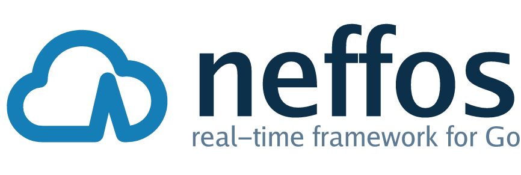

<picture>
  <source media="(prefers-color-scheme: dark)" srcset="gh_logo_dark.png">
  
</picture>

[](https://github.com/neffos-contrib/bootstrap-chat)

[](https://github.com/kataras/neffos/actions) [](https://goreportcard.com/report/github.com/kataras/neffos) [](https://pkg.go.dev/github.com/kataras/neffos) [](https://github.com/kataras/neffos/tree/main/_examples) [](https://github.com/kataras/neffos.js)

## About neffos

Neffos is a cross-platform real-time framework with an expressive, elegant API written in [Go](https://go.dev). Neffos eases common tasks needed in real-time backend and frontend applications, such as:

- Scale-out using redis or nats[*](_examples/07-scale-out), with `StackExchangeCloser` to release it on shutdown and `NSConn.Broadcast` for a same-server send
- Adaptive request upgradation and server dialing
- Three backends: gorilla, gobwas, coder
- Acknowledgements
- Namespaces
- Rooms
- Broadcast
- Event-Driven architecture
- Request-Response architecture
- Error Awareness
- Asynchronous Broadcast
- Heartbeat, close status codes and a message size limit
- Graceful shutdown
- Timeouts
- Encoding
- Reconnection (neffos.js)
- Modern neffos API client for Browsers, Node.js[*](https://github.com/kataras/neffos.js) and Go

## Installation

Go 1.27 or later is required.

```sh
go get github.com/kataras/neffos@latest
```

## Learning neffos

<details>
<summary>Quick View</summary>

## Server

```go
import (
    // [...]
    "github.com/kataras/neffos"
    "github.com/kataras/neffos/gorilla"
)

func runServer() {
    events := make(neffos.Namespaces)
    events.On("/v1", "workday", func(ns *neffos.NSConn, msg neffos.Message) error {
        date := string(msg.Body)

        t, err := time.Parse("01-02-2006", date)
        if err != nil {
            // Return the parse error back to the client.
            return err
        }

        if t.Weekday() == time.Saturday || t.Weekday() == time.Sunday {
            // Fire the "notify" client event instead of replying.
            return ns.Send("notify", []byte("day off"))
        }

        // Reply back to the client.
        responseText := fmt.Sprintf("it is %s, do your job.", t.Weekday())
        return neffos.Reply([]byte(responseText))
    })

    // WithTimeout adds a read timeout and a heartbeat on top of the namespaces.
    websocketServer := neffos.New(gorilla.DefaultUpgrader, neffos.WithTimeout{
        ReadTimeout:  60 * time.Second,
        PingInterval: 20 * time.Second,
        Namespaces:   events,
    })

    router := http.NewServeMux()
    router.Handle("/", websocketServer)

    log.Println("Serving websockets on localhost:8080")
    log.Fatal(http.ListenAndServe(":8080", router))
}
```

## Go Client

```go
func runClient() {
    ctx := context.TODO()
    events := make(neffos.Namespaces)
    events.On("/v1", "notify", func(c *neffos.NSConn, msg neffos.Message) error {
        log.Printf("Server says: %s\n", string(msg.Body))
        return nil
    })

    // Connect to the server.
    client, err := neffos.Dial(ctx,
        gorilla.DefaultDialer,
        "ws://localhost:8080",
        events)
    if err != nil {
        panic(err)
    }

    // Connect to a namespace.
    c, err := client.Connect(ctx, "/v1")
    if err != nil {
        panic(err)
    }

    fmt.Println("Please specify a date of format: mm-dd-yyyy")

    for {
        fmt.Print(">> ")
        var date string
        fmt.Scanf("%s", &date)

        // Send to the server and wait for a reply to this message.
        response, err := c.Ask(ctx, "workday", []byte(date))
        if err != nil {
            if neffos.IsCloseError(err) {
                // Check if the error is a close signal,
                // or make use of the `<- client.NotifyClose`
                // read-only channel instead.
                break
            }

            // >> 13-29-2019
            // error received: parsing time "13-29-2019": month out of range
            fmt.Printf("error received: %v\n", err)
            continue
        }

        // >> 06-29-2019
        // it is a day off!
        //
        // >> 06-24-2019
        // it is Monday, do your job.
        fmt.Println(string(response.Body))
    }
}
```

## Browser Client

```html
<script src="https://cdn.jsdelivr.net/npm/neffos.js@0.3/dist/neffos.global.min.js"></script>
<script>(async () => {
  const conn = await neffos.dial("ws://localhost:8080", { "/v1": { notify: (ns, msg) => console.log(msg.Body) } });
  const nsConn = await conn.connect("/v1");
  await nsConn.ask("workday", "06-24-2019");
})();</script>
```

## Javascript Client

Navigate to: <https://github.com/kataras/neffos.js>

</details>

The **[wiki](https://github.com/kataras/neffos/wiki)** covers every feature with a page of its own, from the first echo server to scaling out over Redis or NATS.

For detailed technical documentation, head over to [pkg.go.dev](https://pkg.go.dev/github.com/kataras/neffos). For executable code, visit the [_examples](_examples/) directory.

## What's new

See [HISTORY.md](HISTORY.md) for the full changelog. If you are upgrading from a v0.0.x release, read the migration guide on the wiki: [Migrating-to-v0.1.0](https://github.com/kataras/neffos/wiki/Migrating-to-v0.1.0).

## Contributing

We'd love to see your contribution to the neffos real-time framework! For more information about contributing to the neffos project please check the [CONTRIBUTING.md](CONTRIBUTING.md) file.

- [neffos-contrib](https://github.com/neffos-contrib) github organisation for more programming languages support, please invite yourself.

## Security Vulnerabilities

If you discover a security vulnerability within neffos, please send an e-mail to [neffos-go@outlook.com](mailto:neffos-go@outlook.com). All security vulnerabilities will be promptly addressed.

## License

The word "neffos" has a greek origin and it is translated to "cloud" in English dictionary.

This project is licensed under the [MIT license](https://opensource.org/licenses/MIT).
<!-- [](https://app.fossa.io/projects/git%2Bgithub.com%2Fkataras%2Fneffos?ref=badge_large) -->
